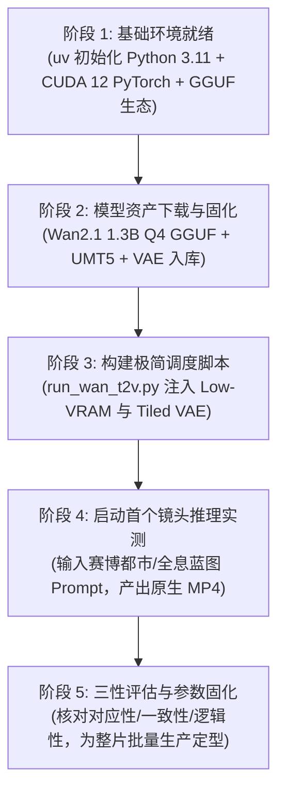

# 4GB 显存本地端到端文生视频（Wan 2.1 1.3B GGUF）方案与实施规划

## 一、 项目定位与核心共识

1. **拒绝曲线救国，坚守纯血文生视频（T2V）**：
   - 坚决不采用“静态图片 + FFmpeg 运镜缩放”的假视频方案；
   - 必须采用当前业界正统的文生视频通用大模型（Diffusion Transformer 架构），直接从自然语言 Prompt（提示词）出发，在神经网络潜空间中完成多步迭代去噪，最终解码出具备连续物理运动规律的真正原生视频。
2. **务实画质与严格逻辑平衡**：
   - **接受降维换稳定**：首轮不盲目追求 1080P/4K 精美画质，务实接受降低分辨率（480×272 或 512×288）和帧率（8~12 fps，33~49 帧），确保 4G 显存绝对不发生 CUDA OOM（内存溢出）；
   - **核心三性不妥协**：画面在“**语义对应性（Text Alignment）**”、“**时空一致性（Temporal Consistency）**”和“**运动逻辑性（Physical Logic）**”上的标准与正片完全看齐，确保人物不融化、物体不撕裂、动作符合物理直觉。

---

## 二、 硬件边界与算力适配机制

* **物理显存**：NVIDIA Quadro T1000（4GB 专用显存）
* **系统内存**：19GB 共享内存（System RAM）
* **磁盘空间**：H 盘剩余 830+ GB（空间充裕）

### 突破 4G 显存极限的三大底层支柱：
1. **GGUF 进阶量化（Q4_K_M）**：
   - 原版 FP16 需 8.19GB 显存，经 K-quants 混合精度量化后，核心主干权重压缩至 **1.2GB ~ 1.4GB**；
2. **CPU / RAM 内存流水线卸载（Block Swapping / CPU Offload）**：
   - 巧妙利用 19GB 系统内存作为缓冲水库，仅将当前计算的 Transformer Block 动态调入 4G 显存，算完即卸载，显存峰值硬性锁定在 **3.2GB ~ 3.5GB** 安全线内；
3. **分块解码（Tiled VAE）**：
   - 视频最终解码环节采用空间/时间切片解码，彻底消除高分辨率带来的瞬时显存尖峰。

---

## 三、 核心技术选型与推荐参数

| 配置项 | 推荐实测参数 | 选型理由与技术依据 |
| :--- | :--- | :--- |
| **基础模型** | `Wan2.1-T2V-1.3B` | 阿里开源原生小尺寸 DiT 架构，相比强行剪枝的大模型更完整，4G 卡最优解 |
| **模型格式** | `GGUF (Q4_K_M)` | 甜点档位，权重损失 < 5%，若遇极端显存尖峰可平滑降级至 `Q3_K_M` |
| **文本编码器** | `UMT5-XXL (FP8 / INT4)` | 保持文本语义理解高精度，驻留系统内存，不挤占 4G 显卡 |
| **视频解码器** | `Wan2.1_VAE (Tiled)` | 开启 Tiling 模式切片解码，杜绝 OOM |
| **推荐分辨率** | `480 × 272` 或 `512 × 288` | 16:9 标准比例，潜空间计算负荷小，主体更不容易畸变 |
| **帧数与时长** | `33 ~ 49 帧`（约 3 ~ 5 秒） | 短时范围内 DiT 时间注意力高度聚焦，时间一致性达到最佳状态 |
| **采样帧率** | `8 ~ 12 FPS` | 原生采样率，产出后可通过 FFmpeg 或轻量插帧倍增至 24 FPS |
| **显存策略** | `Low VRAM / CPU Offload` | 将大部分中间特征与等待层卸载至系统内存 |

---

## 四、 完整落地实施计划（分步执行路线）



### 阶段 1：独立运行时环境搭建
* 在 `H:\localllm\T2V` 目录下，直接调用系统自带的 `uv` 工具创建完全隔离的虚拟环境；
* 安装匹配 CUDA 12 的轻量版 PyTorch，以及 `diffusers`、`accelerate`、`gguf` 底层依赖。

### 阶段 2：模型资产下载与目录规划
规划清晰的资产管理结构：
```text
H:\localllm\T2V\
├── models/
│   ├── diffusion_models/   # 存放 Wan2.1-T2V-1.3B-Q4_K_M.gguf (~1.2GB)
│   ├── text_encoders/      # 存放 UMT5-XXL 轻量化文本编码器
│   └── vae/                # 存放 Wan2.1 官方 VAE 模型
├── output/                 # 存放最终产出的 AI 原生动态视频切片
├── src/                    # 底层调度与推理引擎
└── run_wan_t2v.py          # 用户一键运行的主控命令
```

### 阶段 3：编写无头推理引擎（Headless Runner）
* 编写无需繁琐网页界面的纯 Python 推理脚本；
* 内置针对 Quadro T1000 的专属防御机制：启动显存监测哨兵，一旦显存超过 3.6GB 自动激活垃圾回收与分块换页。

### 阶段 4：单镜头全流程闭环验证
* **输入测试提示词**：  
  `"A futuristic cyberpunk city at night, rain-slicked streets reflecting neon lights, a creator standing in front of high-rise window looking at a glowing blue holographic system blueprint, cinematic forward motion, realistic physics."`
* **执行时间预期**：单段预计耗时 **3 ~ 6 分钟**；
* **验收标准**：在 `output/` 目录下生成一个真实的、带有连续向前运镜与全息光流真实运动的 `.mp4` 文件！

---

## 五、 后续整片工业化流水线展望

当首个镜头在本地完全走通闭环后，我们将整篇 3 分 25 秒的口播文稿按场景拆分为 **25~30 个分镜头 Prompt**，脚本在后台自动批处理排队运算，逐步生成所有分镜切片，最后与本地的沉稳配音、短句动态字幕无缝拼装，实现 100% 本地纯血 AIGC 视频全量交付！
